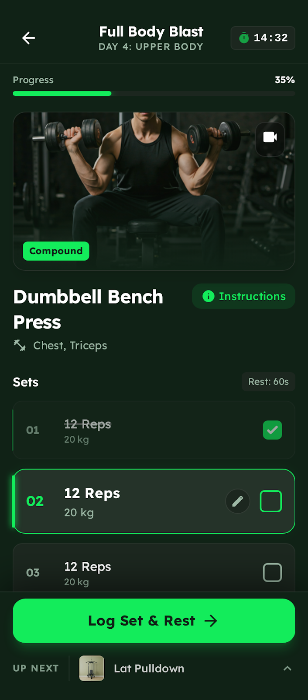

# 🏋️ AI Workout Tracker

A mobile-first iOS workout app with AI-powered workout generation using ChatGPT API, muscle recovery tracking, and progressive overload calculations.



## ✨ Features

### 🤖 AI Workout Generation
- ChatGPT-powered workout creation
- Smart muscle recovery analysis
- Personalized exercise recommendations
- Quick workout templates (Push/Pull/Legs/Full Body)
- Custom workout prompts

### 💪 12 Muscle Group Tracking
- Chest, Back, Shoulders
- Biceps, Triceps, Forearms
- Abs, Obliques, Lower Back
- Quads, Hamstrings, Calves
- Real-time recovery status (3+ days = fresh)
- Visual recovery indicators

### 🎯 Weekly Set Targets
- Push Muscles: 27 sets/week
- Pull Muscles: 15 sets/week
- Leg Muscles: 21 sets/week
- Hexagon progress visualization
- Automatic tracking

### 📊 Workout Logging
- Complete workout history
- Exercise details (sets, reps, weight)
- Volume tracking
- Progressive overload monitoring
- LocalStorage persistence

### 📱 Mobile-First iOS Design
- Optimized for iPhone
- iOS safe areas support
- Smooth animations (Framer Motion)
- Bottom navigation
- Gesture-friendly UI
- Dark mode

## 🚀 Getting Started

### Prerequisites
- Node.js 18+
- OpenAI API key

### Installation

1. **Clone the repository**
```bash
git clone https://github.com/Kyletho2020/Workout_App.git
cd Workout_App
```

2. **Install dependencies**
```bash
npm install
```

3. **Set up environment variables**
Create a `.env` file in the root directory:
```bash
VITE_OPENAI_API_KEY=your_openai_api_key_here
```

4. **Start development server**
```bash
npm run dev
```

5. **Open in browser**
- Navigate to `http://localhost:5173`
- For mobile testing: Use browser dev tools (iPhone 14 Pro viewport)
- For bolt.new: Import the project folder

## 🎨 Tech Stack

- **Frontend**: React 18
- **Build Tool**: Vite 5
- **Styling**: CSS3 with CSS Variables
- **Animations**: Framer Motion
- **Icons**: Lucide React
- **AI**: OpenAI GPT-4o-mini
- **Storage**: LocalStorage
- **Mobile**: iOS optimized with safe areas

## 📖 Usage

### 1. Generate AI Workout
1. Tap the `+` floating action button
2. Choose a workout type:
   - 💪 Push Day
   - 🔙 Pull Day
   - 🦵 Leg Day
   - 💪 Upper Body
   - 🏋️ Full Body
   - ✨ Custom (describe your own)
3. AI generates personalized workout based on:
   - Fresh/recovered muscles (3+ days rest)
   - Weekly volume targets
   - Your preferences

### 2. Track Recovery
- Navigate to **Body** tab
- View all 12 muscle groups
- See days since last workout
- Check which muscles are fresh (green)
- Plan your next workout accordingly

### 3. Monitor Targets
- Go to **Targets** tab
- View weekly set goals by muscle group
- Track progress with hexagon visualization
- Adjust training volume as needed

### 4. Review History
- Open **Log** tab
- Browse past workouts
- Analyze volume and frequency
- Track progressive overload

## 🔧 Configuration

### Customize Weekly Targets
Edit `src/App.jsx`:
```javascript
const [weeklyTargets, setWeeklyTargets] = useState({
  pushMuscles: { current: 0, target: 27, name: 'Push Muscles' },
  pullMuscles: { current: 0, target: 15, name: 'Pull Muscles' },
  legMuscles: { current: 0, target: 21, name: 'Leg Muscles' }
});
```

### Change Recovery Threshold
Default is 3 days. Modify in `src/App.jsx`:
```javascript
const isFresh = days >= 3; // Change 3 to your preferred days
```

### Customize AI Model
Edit the OpenAI model in `src/App.jsx`:
```javascript
model: 'gpt-4o-mini', // Change to gpt-4, gpt-3.5-turbo, etc.
```

## 📱 Bolt.new Deployment

1. Create new project on [bolt.new](https://bolt.new)
2. Upload all files from this repository
3. Add environment variable:
   - Key: `VITE_OPENAI_API_KEY`
   - Value: Your OpenAI API key
4. Run `npm run dev`
5. Test on mobile viewport

## 🏗️ Project Structure

```
Workout_App/
├── src/
│   ├── App.jsx          # Main app component
│   ├── App.css          # Mobile-first styles
│   ├── main.jsx         # React entry point
│   └── index.css        # Global styles
├── index.html           # HTML template
├── package.json         # Dependencies
├── vite.config.js       # Vite configuration
├── .env                 # Environment variables (create this)
├── .gitignore          # Git ignore rules
└── README.md           # This file
```

## 🎯 Roadmap

- [ ] Add exercise database
- [ ] Implement workout tracking during session
- [ ] Add rest timer
- [ ] Progressive overload suggestions
- [ ] Export workout data
- [ ] Social sharing
- [ ] PWA support
- [ ] Offline mode
- [ ] Exercise form videos
- [ ] Nutrition tracking

## 🐛 Troubleshooting

### AI Generation Fails
- Check OpenAI API key is correct
- Verify you have API credits
- Check browser console for errors

### LocalStorage Issues
- Clear browser storage
- Check browser privacy settings
- Ensure cookies/storage enabled

### Mobile Layout Issues
- Use Chrome DevTools device emulation
- Test on actual iOS device
- Check viewport meta tag

## 📄 License

MIT License - feel free to use this project for learning or personal use.

## 🙏 Acknowledgments

- OpenAI for ChatGPT API
- Framer Motion for animations
- Lucide for icons
- The fitness community for inspiration

## 💬 Contact

Kyle Thompson - [@Kyletho2020](https://github.com/Kyletho2020)

Project Link: [https://github.com/Kyletho2020/Workout_App](https://github.com/Kyletho2020/Workout_App)

---

Built with ❤️ and 💪 for the fitness community
